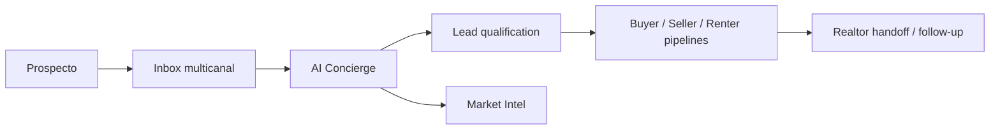

# Hawk Guru Realtor Suite

CRM inmobiliario multicanal para equipos de Realtors. Centraliza conversaciones, califica prospectos y organiza cada oportunidad en pipelines de Buyer, Seller y Renter.

## Qué incluye

- Inbox unificado para WhatsApp, Instagram, Messenger y Telegram.
- Pipelines inmobiliarios con score, tags, siguiente acción e historial de etapas.
- AI Concierge para responder, calificar y escalar conversaciones al equipo.
- Market Intel con base de conocimiento, documentos de áreas, procesos y FAQs.
- Follow-up y campañas segmentadas por intención y actividad.
- D1, Durable Objects, Vectorize y R2 sobre Cloudflare.

## Arquitectura



## Desarrollo

```bash
pnpm install
pnpm dev
```

Comprueba el proyecto con:

```bash
pnpm typecheck
pnpm test
```

## Cloudflare

La instancia requiere los bindings declarados en `wrangler.toml`:

- D1: `hawk_guru_realtor_db`
- Vectorize: `hawk-guru-realtor-kb`
- R2: `hawk-guru-realtor-catalog`

Los secretos nunca entran en Git. Configura `OPENAI_API_KEY` y `DASHBOARD_PASSWORD` directamente en Cloudflare antes de habilitar el AI Concierge y el panel.

## Próximas capacidades

- Seller valuation lead magnet y Buyer readiness quiz.
- Seguimiento por etapa con aprobación humana.
- Property match alerts y saved-search digests.
- Open-house check-in y campañas post-showing.
- Realtor Lead Analyst con salida estructurada y trazabilidad.
